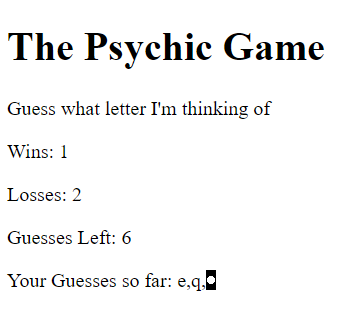

# Psychic-Game

### Psychic-Game Main Page
***

The goal of this game is to guess which alphabet the program is thinking about.

***

Guessed alphabets by the user is shown on the screen.

***

When the user gets 9 times wrong, loss count is incremented.

***

When the user guesses it right, win count is incremented.

